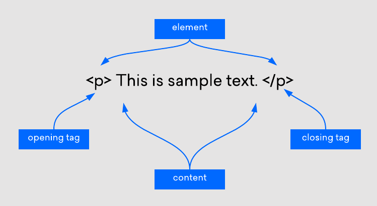
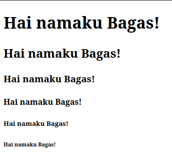
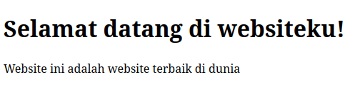
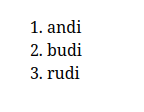
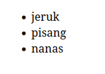

# HTML


## Daftar Isi

1. [Apa itu HTML](#apa-itu-html)
2. [Elemen HTML](#elemen-html)
3. [Jenis-jenis elemen HTML](#jenis-html)
   - head
   - title
   - link
   - body
   - heading
   - paragraph
   - image
   - a (hyperlink)
   - ordered list
   - unordered list
4. [Hubungan HTML dengan CSS dan JS](#hubungan)
5. [Membuat Web Biodata Diri](#biodata)

## 1. Apa itu HTML
<a id="apa-itu-html"></a>

HTML merupakan singkatan dari *Hypertext Markup Language*, yaitu bahasa markup standar untuk membuat dan menyusun halaman dan aplikasi web. HTML digunakan untuk mendefinisikan struktur dan elemen-elemen dalam halaman web, seperti teks, gambar, tautan, tabel, formulir, dan banyak elemen lainnya.

Contoh penulisan HTML sederhana adalah sebagai berikut

```
<!DOCTYPE html>
<html>
<head>
	<meta charset="utf-8">
	<meta name="viewport" content="width=device-width, initial-scale=1">
	<title>Websiteku</title>
	<link rel="stylesheet" type="text/css" href="style.css">
</head>
<body>
	<h1>Hello World!</h1>
</body>
</html>
```

## 2. Elemen HTML
<a id="elemen-html"></a>

Elemen HTML terdiri dari beberapa komponen yaitu:



## 3. Jenis-Jenis Elemen HTML
<a id="jenis-html"></a>

**a. `head`**

Elemen `head` dalam HTML adalah bagian dari struktur dasar dari sebuah halaman web. Elemen ini berisi `metadata` dan elemen-elemen lain yang berhubungan dengan halaman web. Isi dari elemen ini tidak akan terlihat oleh pengguna, tetapi sangat penting untuk pengaturan dan optimasi halaman web.

**b. `title`**

Elemen `title` dalam HTML merupakan judul dari halaman web. Biasanya akan muncul di tab browser.

**c. `link`**

Elemen `link` dalam HTML berfungsi untuk menghubungkan *resource* luar, biasanya stylesheet (JS dan CSS), ke dalam dokumen HTML.

**d. `body`**

Elemen `body` dalam HTML berisi semua elemen yang akan terlihat dalam halaman web. Apapun yang ingin ditampilkan dalam web harus masuk ke dalam tag `<body>`.

**e. `heading`**

Elemen `heading` dalam HTML dapat dibayangkan seperti judul dan sub-judul sebuah buku. Dalam HTML, terdapat 6 macam heading mulai dari `<h1>` sampai `<h6>`. Berikut merupakan contoh penggunaan heading:
```
<h1>Hai namaku Bagas!</h1>
<h2>Hai namaku Bagas!</h2>
<h3>Hai namaku Bagas!</h3>
<h4>Hai namaku Bagas!</h4>
<h5>Hai namaku Bagas!</h5>
<h6>Hai namaku Bagas!</h6>
```

Hasil:




**f. `paragraph`**

Elemen ini digunakan untuk teks yang berupa paragraf, dilambangkan dengan tag `<p>`. Contoh penggunaannya adalah sebagai berikut:
```
<h1>Selamat datang di websiteku!</h1>
<p>Website ini adalah website terbaik di dunia</p>

```

Hasil:



**g. `image`**

Elemen ini berfungsi untuk memasang gambar kepada halaman web, dilambangkan dengan tag ``. `src` diisi dengan nama file gambar relatif dengan lokasi file html. Apabila gambarnya berada di folder yang sama dengan html maka penulisannya akan seperti ini:

```

```

Sedangkan apabila gambar berada di sebuah folder bernama `img`, maka penulisannya seperti ini:

```

```

**h. `a`**

Elemen ini digunakan untuk memasang `hyperlink` dimana apabila ditekan dapat mengalihkan ke suatu halaman lain. Misalkan kita memiliki sebuah file html bernama `halo.html`, dengan menggunakan aturan yang sama seperti pada bagian `img`, kita dapat mengakses `halo.html` dari halaman web lain.

```
<a href="halo.html">Ini link!</a>
```


**i. `ordered list`**

Elemen ini digunakan untuk membuat sebuah list yang memiliki penomoran. Sebuah ordered list diinisiasikan dengan tag `<ol>` lalu akan diisi list menggunakan tag `<li>`. Contoh penggunaannya adalah sebagai berikut:
```
<ol>
	<li>andi</li>
	<li>budi</li>
	<li>rudi</li>
</ol>
```

Hasil:



**j. `unordered list`**

Elemen ini digunakanuntuk membuat sebuah list dengan bullet point. Sebuah unordered list diinisiasikan dengan tag `<ul>` lalu akan diisi list menggunakan tag `<li>`. Contoh penggunaannya adalah sebagai berikut:
```
<ul>
	<li>jeruk</li>
	<li>pisang</li>
	<li>nanas</li>
</ul>
```

Hasil:



## 4. Hubungan HTML dengan CSS dan JS
<a id="hubungan"></a>

Meskipun dinyatakan sebagai bahasa markup yang canggih dan mudah, HTML tidak sepenuhnya bisa membuat website yang profesional dan responsif. Bahasa ini hanya bisa digunakan untuk menambah elemen dan membuat struktur konten.

Namun di satu sisi, bahasa ini bisa bekerja secara maksimal dengan dua bahasa frontend: CSS (Cascading Style Sheets) dan JavaScript. Jika digabungkan, kedua bahasa frontend ini bisa meningkatkan pengalaman user dan memberikan fungsi yang lebih canggih.

- CSS berkaitan dengan styling, seperti background, warna, layout, spacing, dan animiasi.
- JavaScript memungkinkan Anda menambahkan fungsionalitas yang dinamis, seperti slider, pop-up, dan galeri foto.

Untuk memberikan gambaran, perbedaan antara HTML, CSS, dan JavaScript dapat diibaratkan seperti ini: HTML adalah seperti seseorang yang belum berpakaian, kemudian CSS adalah pakaian yang dikenakannya, dan JavaScript adalah aktivitas dan sikap orang tersebut.

## 5. Membuat Web Biodata Diri
<a id="biodata"></a>

- Buat sebuah file html bernama `index.html`
  
- Buatlah template html terlebih dahulu
  
  ```
  <!DOCTYPE html>
  <html>
  <head>
    <meta charset="utf-8">
    <meta name="viewport" content="width=device-width, initial-scale=1">
    <title></title>
  </head>
  <body>

  </body>
  </html>
  ```
- Tambahkan title untuk websitenya di dalam `<head>`
  
  ```
    <title>Biodata diriku</title>
  ```
- Tambahkan sebuah heading sebagai judul

  ```
    <h1>Biodata diri</h1>
  ``` 
- Tambahkan file foto diri ke folder yang sama dengan file `index.html`. Misalkan nama fotonya `foto.jpg`. Tambahkan cuplikan dibawah ke dalam `index.html`

  ```
    
  ```
- Tambahkan nama dan tempat/tanggal lahir
  ```
    <p>Nama : Ucup</p>
    <p>Tempat/Tanggal Lahir : Surabaya, 12 Januari 2006</p>
  ```
- Tambahkan list hobi dengan menggunakan `<ul>`

  ```
    <p>Hobi :</p>
    <ul>
      <li>bermain</li>
      <li>makan</li>
      <li>bernyanyi</li>
    </ul>
  ```
