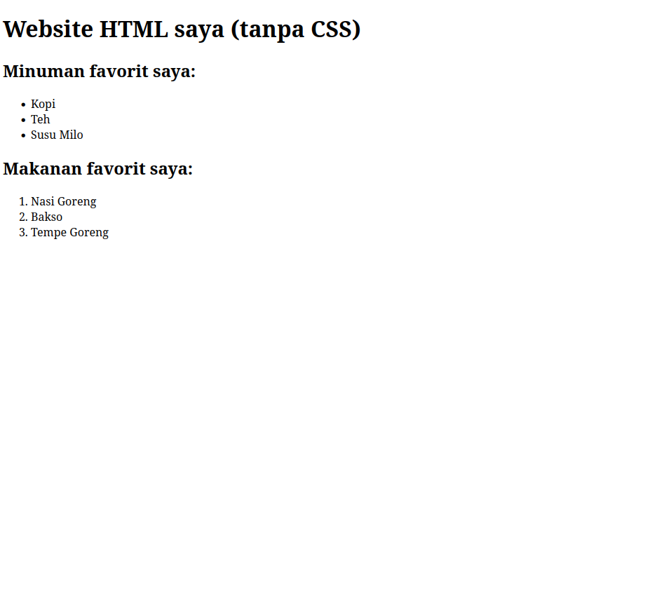
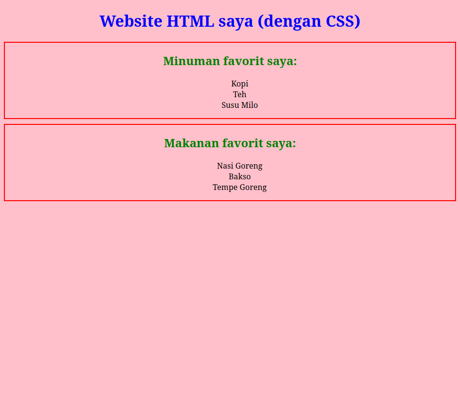
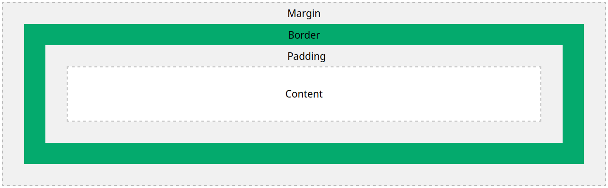
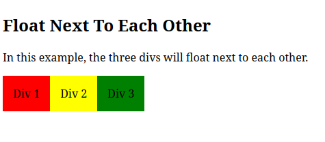

# Pembelajaran CSS

## Daftar Isi

- [Pengenalan CSS](#pengenalan-css)
    + [Apa itu CSS?](#apa-itu-css)
    + [Mengapa CSS penting?](#mengapa-css-penting)
- [Materi Teknis CSS](#materi-teknis-css)
    + [Syntax](#syntax)
    + [Comments](#comments)
    + [Selectors](#selectors)
    + [Linking ke HTML](#linking-ke-html)
    + [Colors](#colors)
    + [Backgrounds](#backgrounds) <!--- Tambahkan section gradient ke sini --->
    + [Borders](#borders) <!--- Tambahkan section rounded corners ke sini --->
    + [Margins](#margins)
    + [Padding](#padding)
    + [Height/Width](#heightwidth)
    + [Box Model](#box-model)
    + [Outline](#outline)
    + [Text](#text)
    + [Fonts](#fonts)
    + [Links](#links)
    + [Lists](#lists)
    + [Tables](#tables)
    + [Display](#display)
    + [Max-width](#max-width)
    + [Position](#position)
    + [Z-index](#z-index)
    + [Overflow](#overflow)
    + [Float](#float)
    + [Inline-block](#inline-block)
    + [Align](#align)
    + [Opacity](#opacity)
    + [Navbar](#navbar)
    + [Specificity](#specificity)

## Pengenalan CSS

### Apa itu CSS?

|  |
| :---: |

CSS adalah sebuah tipe file dan bahasa styling yang umum digunakan untuk menerapkan sebuah desain kepada sebuah laman *website*.
CSS adalah singkatan dari Cascading Style Sheets. CSS memiliki sintaks yang mendeskripsikan desain kepada tag-tag dalam HTML.
File CSS dibuat dengan memberikan ekstensi `.css` kepada sebuah file teks. File-file CSS dapat di-edit dengan menggunakan editor teks
apapun, namun untuk mempermudah proses *coding*, disarankan menggunakan editor kode seperti Sublime Text dan Visual Studio Code.

### Mengapa CSS penting?

Pembuatan website dapat dilakukan semata-mata hanya dengan HTML saja, namun hasilnya akan terlihat sangat sederhana dan tidak menarik.
Tampilan website yang hanya dibuat dengan HTML melalui tag-tag saja akan terlihat seperti dokumen cetak/*printed document*.
Hal tersebut tentu saja sangat mengekang bagaimana seorang programmer dapat mengekspresikan sebuah laman website.
Pada zaman modern, website tidak hanya berfungsi sebagai media penyaluran informasi saja, namun juga menjadi media promosi, hiburan, dan media sosial.
Tentu saja website harus berpenampilan menarik dan mudah digunakan agar tujuan/fungsi website dapat tercapai dengan baik.
Dengan menggunakan CSS, tujuan dan tampilan-tampilan yang diharapkan dapat tercapai dengan mudah.

Berikut adalah perbandingan antara website tanpa CSS dan website dengan CSS:

|  |
| :---: |
| Tampilan website tanpa menggunakan CSS |

|  |
| :---: |
| Tampilan website dengan menggunakan CSS |

Dapat dilihat bahwa laman website kedua memiliki warna latar belakang, warna teks, dan peletakan teks yang dapat diatur oleh programmer.

## Materi Teknis CSS

### Syntax

|  |
| :---: |

*Style* penulisan kode CSS yang baik adalah sebagai berikut:

```css
h1 {
    color: blue;
    font-size: 12px;
}
```

Bagian *selector* CSS dapat dikenakan kepada berbagai elemen sekaligus seperti pada contoh berikut:

```css
h1, h2, h3, p {
    color: red;
}
```

Hal tersebut berarti elemen `h1`, `h2`, `h3`, dan `p` semuanya diberikan property `color` atau warna yaitu merah.

### Comments

Kita dapat menambahkan *comment* atau barisan kode yang tidak akan dihiraukan oleh browser ketika laman website dibuka.

```css
h1 {
    /* Ini adalah baris komentar, yang mana tidak akan dihiraukan oleh browser */
    color: yellow;
}
```

### Selectors

CSS menggunakan *selector* untuk menerapkan nilai-nilai property pada tag-tag HTML.
Selector CSS terbagi menjadi beberapa kategori, yaitu selector sederhana/simple, selector combinator, selector pseudo-class, selector pseudo-element, dan selector attribute.

Selector sederhana terdiri dari:

| Jenis Selector    | Penggunaan | Target Seleksi |
| ----------------- | ---------- | -------------- |
| Selector elemen   | `h1 { property:value; }` | Semua elemen `h1` |
| Selector class    | `.welcome { property:value; }` | Semua elemen dengan class `welcome` |
| Selector elemen.class | `p.slogan { property:value; }` | Semua elemen `p` yang memiliki class `slogan` |
| Selector id       | `#judul { property:value; }` | Elemen dengan id `judul` |
| Selector universal| `*` | Semua elemen |
| Selector grouping | `h1, p, div { property:value; }` | Semua elemen `h1`, `p`, `div` |

Selector combinator terdiri dari:

| Jenis Selector    | Penggunaan | Target Seleksi |
| ----------------- | ---------- | -------------- |
| descendant selector (spasi) | `div p { prop:val; }` | Semua elemen `p` dalam sebuah elemen `div` |
| child selector (>) | `div > p { prop:val; }` | Semua elemen `p` yang merupakah anak langsung dari elemen `div` |
| adjacent sibling selector (+) | `div + p { prop:val; }` | Semua elemen `p` yang berada **tepat** setelah elemen `div` |
| general sibling selector (~) | `div ~ p { prop:val; }` | Semua elemen `p` yang berada setelah elemen `div` |

Untuk penjelasan lebih detail mengenai selector pseudo-class, pseudo-element, dan attribute, kunjungi tautan berikut: [CSS Selectors - MDN](https://developer.mozilla.org/en-US/docs/Web/CSS/CSS_selectors)

### Linking ke HTML

Ada 3 cara untuk memasukkan CSS ke dalam laman HTML, yaitu melalui CSS inline, internal, dan eksternal.

CSS inline adalah CSS yang dimasukkan secara eksplisit langsung ke dalam suatu tag HTML.
CSS inline hanya akan berpengaruh pada elemen di mana ia diterapkan.

```html
<p style="color: red;">Ini adalah sebuah paragraf berwarna merah.</p>
```

CSS internal adalah CSS yang dimasukkan ke dalam file HTML dalam tag `style` yang terletak di dalam tag `head`.
CSS internal bisa mempengaruhi semua tag yang ada di satu file HTML berdasarkan selector yang dipakai.

```html
<!DOCTYPE html>
<html>
<head>
    <style>
        body {
            color: red;
        }
    </style>
</head>
<body>
    <p>Halo semuanya!</p>
</body>
</html>
```

CSS eksternal adalah CSS yang dimasukkan ke dalam file `.css` sendiri yang mana dapat dipakai oleh beberapa file HTML sekaligus.
CSS eksternal dapat dipakai oleh suatu file HTML dengan menggunakan tag `link`. Pada contoh berikut, laman website menggunakan file CSS bernama `style.css`.

```html
<!DOCTYPE html>
<html>
<head>
    <title>Websiteku</title>
    <link rel="stylesheet" type="text/css" href="style.css">
</head>
<body>
    <p>Halo semuanya!</p>
</body>
</html>
```

Pada kebanyakan website, tipe CSS yang digunakan adalah CSS eksternal.
CSS eksternal banyak digunakan karena lebih mudah untuk dimodifikasi dan bisa dipakai oleh banyak laman di saat bersamaan.

### Colors

Warna latar belakang dari suatu elemen dapat ditentukan melalui property `background-color`.

```css
body {
    background-color: red;
}
```

Warna teks dari suatu elemen dapat ditentukan melalui property `color`.

```css
body {
    color: blue; /* Semua teks yang tertampil di viewport website akan berwarna biru */
}
```

Selain menggunakan nama-nama warna seperti `red`, `blue`, dan sebagainya, bisa juga menggunakan nilai RGB, RGBA, HEX, HSL, dan HSLA.

```css
h1 {
    color: red; /* nama warna */
}

h2 {
    color: rgb(255, 0, 0); /* RGB: red, green, blue */
}

h3 {
    color: rgba(255, 0, 0, 1);
    /* RGBA: red, green, blue, alpha; Alpha adalah kadar transparansi warna. Alpha = 0.0 adalah transparan. Alpha = 1.0 adalah tak tembus pandang*/
}

h4 {
    color: #ff0000; /* nilai warna heksadesimal; setiap 2 digit mewakili R, G, dan B */
}

h5 {
    color: hsl(0, 100%, 50%);
    /* HSL: hue, saturation, lightness; Hue = 0 adalah merah. Hue = 120 adalah hijau. Hue = 240 adalah biru. Saturation = 0% adalah warna tidak ada. Saturation = 100% adalah warna penuh. Lightness = 0% adalah warna hitam. Lightness = 100% adalah warna putih */
}

h6 {
    color: hsla(0, 100%, 50%, 1); /* Hue, saturation, lightness, alpha */
}
```

### Backgrounds

Ada beberapa property yang berkaitan dengan manipulasi latar belakang dalam CSS.
Property-property tersebut adalah sebagai berikut:

| Nama Property | Value |
| ------------- | ----- |
| background-color | *color* |
| background-image | `url(file_path.extension)` |
| background-repeat | `repeat-x`, `repeat-y`, `no-repeat` |
| background-position | `top`, `bottom`, `left`, `right`, `center` |
| background-attachment | `scroll`, `fixed`, `local` |
| background | `background-color background-image background-repeat background-attachment background-position` |

### Borders

Untuk menampilkan tepian/border untuk suatu elemen, dapat digunakan property-property sebagai berikut:

| Nama Property | Value |
| ------------- | ----- |
| border-width | Ukuran dalam `px` dan unit-unit lain |
| border-style | `dotted`, `solid`, `dashed`, `double`, dan lain-lain |
| border-color | *color* |
| border       | `border-width border-style border-color` |
| border-radius| Ukuran dalam `px` dan unit-unit lain |

Property `border-radius` dapat digunakan untuk memberi kesan lengkungan pada sudut-sudut dari border.

### Margins

Untuk memberikan jarak antar elemen, dapat digunakan property-property sebagai berikut:

| Nama Property | Value |
| ------------- | ----- |
| margin-top | Ukuran dalam unit ukuran tertentu atau `auto` |
| margin-right | Ukuran dalam unit ukuran tertentu atau `auto` |
| margin-bottom | Ukuran dalam unit ukuran tertentu atau `auto` |
| margin-left | Ukuran dalam unit ukuran tertentu atau `auto` |
| margin | Ukuran dalam unit ukuran tertentu atau `auto` |

Value `auto` bisa digunakan untuk melakukan *justify* atau *centering* suatu elemen di sumbu-x. Hal ini memerlukan elemen yang akan di-justify/centered untuk memiliki ukuran yang tidak memenuhi lebar viewport secara penuh.

### Padding

Untuk memberikan jarak antara konten elemen dengan border dari elemen tersebut, dapat digunakan property-property berikut:

| Nama Property | Value |
| ------------- | ----- |
| padding-top | Ukuran dalam unit ukuran tertentu |
| padding-right | Ukuran dalam unit ukuran tertentu |
| padding-bottom | Ukuran dalam unit ukuran tertentu |
| padding-left | Ukuran dalam unit ukuran tertentu |
| padding | Ukuran dalam unit ukuran tertentu |

### Height/Width

Untuk memberikan ukuran tinggi dan lebar elemen, dapat digunakan property-property berikut:

| Nama Property | Value |
| ------------- | ----- |
| height | Ukuran dalam unit ukuran tertentu atau `auto` |
| width | Ukuran dalam unit ukuran tertentu atau `auto` |

### Box Model

Sebuah elemen HTML memiliki struktur bagian sebagai berikut:

|  |
| :---: |
| Dapat dilihat bahwa margin berada di luar border, sedangkan padding di dalam border |

### Text

Selain menggunakan property `color` untuk mewarnai teks, terdapat beberapa property-property lain yang ada yang berhubungan dengan teks, yaitu sebagai berikut:

| Nama Property | Value |
| ------------- | ----- |
| text-align | `left`, `right`, `center`, `justify` |
| text-align-last | `left`, `right`, `center`, `justify` |
| direction | `ltr`, `rtl` |
| vertical-align | `baseline`, `text-top`, `text-bottom`, `sub`, `super` |

### Fonts

CSS dapat menentukan *styling* terhadap font yang digunakan. Property-property yang digunakan terhadap font adalah sebagai berikut:

| Nama Property | Value |
| ------------- | ----- |
| font-family | `serif`, `sans-serif`, `monospace`, `cursive`, `fantasy` |
| font-size | Ukuran dalam unit ukuran tertentu |
| font-weight | `normal`, `bold`, `bolder`, `lighter`, `100..900` |
| font-style | `normal`, `italic`, `oblique` |
| font-variant | `normal`, `small-caps` |
| font | `font-style font-variant font-weight font-size font-family` |

### Lists

CSS dapat memodifikasi *styling* dari list / daftar HTML. Property-property yang digunakan adalah sebagai berikut:

| Nama Property | Value |
| ------------- | ----- |
| list-style-type | `none`, `circle`, `disk`, `square`, `upper-roman`, `lower-alpha` dan masih banyak lagi |
| list-style-image | `url(file_path.extension)` |
| list-style-position | `inside`, `outside` |
| list-style | `list-style-type list-style-position list-style-image` |

### Tables

CSS dapat memperindah tampilan sebuah tabel HTML. Property-property yang seringkali digunakan adalah: `border`, `border-collapse: collapse`, `width`, `height`, `text-align`, `padding`, dan juga `background-color`.

### Display

Suatu elemen HTML dapat ditentukan bagaimana cara menampilkan dirinya sendiri melalui property `display`.
Ada 4 jenis macam value untuk property `display`, yaitu `inline`, `block`, `inline-block`, dan `none`.

Value `inline` memiliki arti bahwa elemen menempati ruang seperlunya saja. Contoh elemen yang bersifat inline adalah `span`, `a`, dan `img`.

Value `block` memiliki arti bahwa elemen akan meng-klaim area lebar dari laman hingga lebar maksimum dari viewport.
Contoh elemen yang bersifat block adalah `p`, `div`, `h1..h6`, `form`, `header`, `footer`, dan `section`.

Value `inline-block` memiliki arti bahwa elemen akan bersifat seperti elemen `inline`, namun bisa diterapkan kepadanya property `width` dan `height` serta `margin` (top & bottom) dan `padding` (top & bottom).

### Position

CSS memungkinkan programmer untuk mendefinisikan posisi suatu elemen dalam laman website. Jenis-jenis metode pemosisian dilaksanakan melalui property `position`, di mana ia menerima value `static`, `relative`, `fixed`,`absolute`, dan `sticky`.

Value `static` adalah default value untuk property `position`, di mana suatu elemen akan tetap pada tempatnya sesuai layout laman.
Value `relative` akan membuka penggunaan property `left`, `right`, `top`, dan `bottom`, di mana posisi akan diubah relatif dengan posisi elemen saat itu. Value `fixed` membuat elemen tidak berubah posisi sama sekali, sehingga terlihat terpaku di posisinya dalam viewport.
Value `absolute` membuat elemen diposisikan relatif terhadap elemen yang melingkupinya (parent element).
Terakhir, value `sticky`, membuat elemen terpaku ke bagian tepian dari box dengan scroll-bar ketika view area meninggalkan tempat asal elemen tersebut.

### Float

CSS memungkinkan penumpukan elemen secara horizontal, baik di kiri maupun kanan, dengan menggunakan property `float`. Value dari property ini adalah `left`, `right`, dan `none`. Jika suatu elemen diberikan `float: left`, maka elemen akan dipindah ke kiri dan elemen setelahnya akan menempati posisi di kanan elemen tersebut, begitu juga sebaliknya dengan `float: right`.

Berikut kode CSS untuk mengilustrasikan bagaimana `float` bekerja:

```html
<!DOCTYPE html>
<html>
<head>
<style>
div {
  float: left;
  padding: 15px; 
}

.div1 {
  background: red;
}

.div2 {
  background: yellow;
}

.div3 {
  background: green;
}
</style>
</head>
<body>

<h2>Float Next To Each Other</h2>

<p>In this example, the three divs will float next to each other.</p>

<div class="div1">Div 1</div>
<div class="div2">Div 2</div>
<div class="div3">Div 3</div>

</body>
</html>
```

Berikut adalah hasil tampilannya:

|  |
| :---: |
